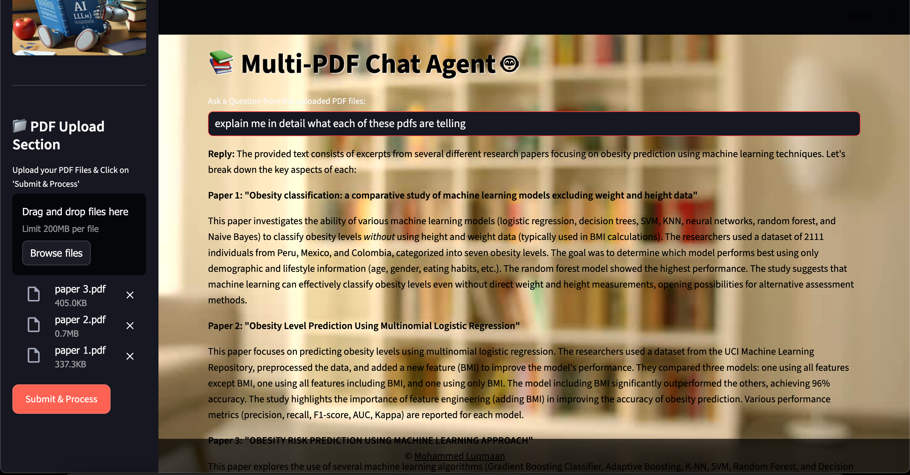

## Overview

The **Multi-PDF Chat Agent** is an intelligent, interactive **PDF-based question-answering chatbot** built using **Streamlit** and **LangChain with Google Generative AI (Gemini)**.

It allows users to **upload multiple PDF files** and **ask natural language questions**. The chatbot intelligently retrieves the most relevant information from the uploaded documents and provides detailed, context-aware answers.

This project is perfect for **researchers, students, or professionals** who want to quickly query large PDF collections without manually reading through them.

## Architecture 


## 🌟 Features

* **Multi-PDF Support**: Upload multiple PDFs at once and process them seamlessly.
* **Advanced Question Answering**: Uses Google Gemini 1.5 Flash for detailed, context-aware responses.
* **Vector-based Document Search**: Efficient similarity search using **FAISS** and **Google Generative AI embeddings**.
* **Interactive Streamlit Interface**: Beautiful, responsive web interface with animations and dynamic background.
* **Custom Styling**: Black labels, white placeholders, animated headers, gradient background, and stylish buttons.
* **Offline Vector Storage**: Saves FAISS index locally for faster subsequent queries.


## 🖼 Screenshots

### Main Interface


### Example Query




---

## 🛠 Technology Stack

* **Frontend / UI**: [Streamlit](https://streamlit.io/)
* **Document Handling**: [PyPDF2](https://pypi.org/project/PyPDF2/)
* **Embeddings & Search**: [LangChain](https://www.langchain.com/), FAISS
* **Language Model**: [Google Gemini 1.5 Flash](https://developers.generativeai.google/)
* **Environment Management**: [Python 3.10+](https://www.python.org/)
* **Styling**: Custom CSS for labels, placeholders, buttons, sidebar, and animations

---

## 📁 Project Structure

```
Multi-PDF-Chat-Agent/
│
├─ app.py                  # Main Streamlit application
├─ .gitignore              # Ignore sensitive & unnecessary files
├─ requirements.txt        # Python dependencies
├─ img/                    # Images folder (background, robot, etc.)
│   ├─ bg.jpg
│   └─ Robot.jpg
├─ faiss_index/            # FAISS vector storage (generated after processing)
└─ README.md
```

---

## ⚡ How It Works

1. **Upload PDFs**
   Users can upload one or multiple PDF files in the sidebar.

2. **Process Documents**
   The app extracts text from the PDFs, splits them into **chunks**, and generates **vector embeddings** using Google Generative AI.

3. **Store & Search Vectors**
   All vectors are stored in a **local FAISS index** for efficient similarity search.

4. **Ask Questions**
   Users type a question in the input field. The chatbot retrieves the most relevant text chunks and uses **Gemini 1.5 Flash** to generate a detailed response.

5. **View Responses**
   The answer is displayed in the main interface in a clean, readable format.

---

## 🚀 Installation

### 1. Clone the repository

```bash
git clone https://github.com/Luqmaan29/Multi-PDF-Chat-Agent.git
cd Multi-PDF-Chat-Agent
```

### 2. Create a virtual environment

```bash
python -m venv venv
source venv/bin/activate       # Mac/Linux
venv\Scripts\activate          # Windows
```

### 3. Install dependencies

```bash
pip install -r requirements.txt
```

### 4. Add your Google API Key

Create a `.env` file in the project root:

```
GOOGLE_API_KEY=your_google_genai_api_key
```

---

## 🏃 Running the App

```bash
streamlit run app.py
```

* Open your browser at the URL shown in the terminal (`http://localhost:8501`)
* Upload PDF files and start asking questions!

---

## 🔒 Security & Privacy

* Your PDFs are **processed locally**; no data is sent externally except for embeddings via the **Google Generative AI API**.
* API keys are stored in `.env` and **should not be pushed to GitHub**.
* FAISS indexes are stored locally for faster access and are **not uploaded** to GitHub.

---

## ✅ Best Practices

* Keep `.env` in `.gitignore`
* Use **clear, descriptive PDF filenames**
* Limit extremely large PDFs (>200MB) for faster processing
* Regularly update dependencies in `requirements.txt`

---

## 📜 Future Enhancements

* Add **PDF text highlighting** for answers
* Enable **voice-based questions and answers**
* Support **multiple languages** (English, French, Kannada, etc.)
* Integrate with **Shop/Inventory datasets** for domain-specific question answering

---

## 🙌 Credits

* Developed by **Mohammed Luqmaan**
* Uses **LangChain**, **FAISS**, and **Google Generative AI**

---

## 📬 Contact

* GitHub: [https://github.com/Luqmaan29](https://github.com/Luqmaan29)
* Email: `mohammedluqmaan29@gmail.com`


Do you want me to do that next?
